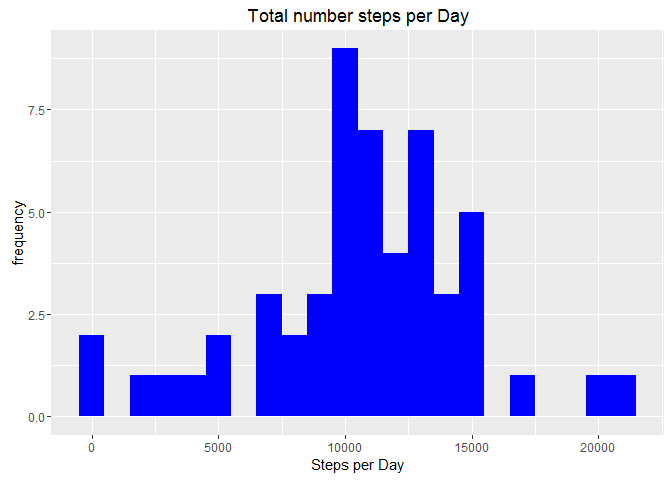
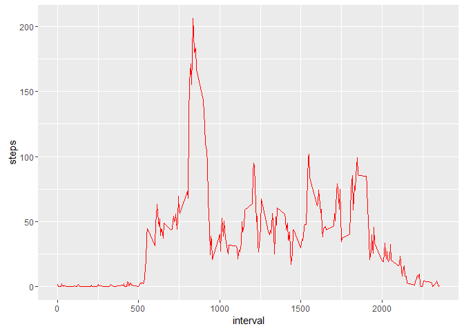
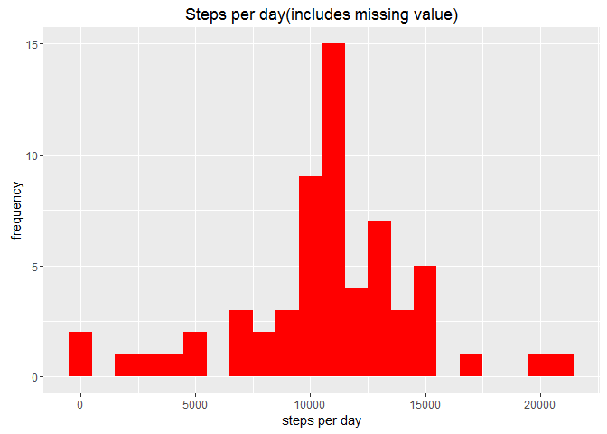

# Reproducible Research: Peer Assessment 1

Loading necessary libraries

```r
library(knitr)
opts_chunk$set(echo=TRUE)
library(dplyr)
```

```
## 
## Attaching package: 'dplyr'
```

```
## The following objects are masked from 'package:stats':
## 
##     filter, lag
```

```
## The following objects are masked from 'package:base':
## 
##     intersect, setdiff, setequal, union
```

```r
library(lubridate)
library(ggplot2)
```
## Loading and preprocessing the data

```r
activityData <- read.csv("activity.csv", header=TRUE,sep=',')
activityData$date <- mdy(activityData$date)
```

check the data with str() and head()

```r
str(activityData)
```

```
## 'data.frame':	17568 obs. of  3 variables:
##  $ steps   : int  NA NA NA NA NA NA NA NA NA NA ...
##  $ date    : POSIXct, format: "2012-10-01" "2012-10-01" ...
##  $ interval: int  0 5 10 15 20 25 30 35 40 45 ...
```

```r
head(activityData)
```

```
##   steps       date interval
## 1    NA 2012-10-01        0
## 2    NA 2012-10-01        5
## 3    NA 2012-10-01       10
## 4    NA 2012-10-01       15
## 5    NA 2012-10-01       20
## 6    NA 2012-10-01       25
```

## What is mean total number of steps taken per day?
For this part missing values need to be ignored

1. Calculate total number of steps taken per day

```r
steps <- activityData %>% 
        filter(!is.na(steps)) %>%
        group_by(date) %>%
        summarize(steps=sum(steps)) %>%
        print
```

```
## Source: local data frame [53 x 2]
## 
##          date steps
##        (time) (int)
## 1  2012-10-02   126
## 2  2012-10-03 11352
## 3  2012-10-04 12116
## 4  2012-10-05 13294
## 5  2012-10-06 15420
## 6  2012-10-07 11015
## 7  2012-10-09 12811
## 8  2012-10-10  9900
## 9  2012-10-11 10304
## 10 2012-10-12 17382
## ..        ...   ...
```

2. Make histogram of the total number of steps taken each day


```r
ggplot(steps,aes(x=steps)) +
        geom_histogram(fill="blue", binwidth = 1000) + 
        labs(title="Total number steps per Day", x="Steps per Day",y="frequency")
```



3. Calculate and report mean and median of the total number of steps taken per day


```r
meanSteps <- mean(steps$steps, na.rm=TRUE)
medianSteps <- median(steps$steps,na.rm=TRUE)
```

Mean steps are 1.0766189\times 10^{4} and median steps are 10765

## What is the average daily activity pattern?

1. Calculate the average number of steps taken in each 5-minute interval per day using dplyr and group by interval


```r
interval <- activityData %>%
                filter(!is.na(steps)) %>%
                group_by(interval) %>%
                summarize(steps = mean(steps))
```

Using ggplot for timeseries of 5 minute interval and average steps

```r
ggplot(interval,aes(x=interval,y=steps)) +
        geom_line(color="red")
```



2. Using which.max() to find out maximum steps on average of all days

```r
interval[which.max(interval$steps),]
```

```
## Source: local data frame [1 x 2]
## 
##   interval    steps
##      (int)    (dbl)
## 1      835 206.1698
```

The interval has 835, on average count of steps of 206

## Imputing missing values
1. Summarize missing values


```r
sum(is.na(activityData$steps))
```

```
## [1] 2304
```
Missing values are 2304

2. To fill missing NA values with average number of steps 


```r
datanew <- activityData
nas <- is.na(datanew$steps)
avginterval <- tapply(datanew$steps, datanew$interval,mean,na.rm=TRUE,simplify=TRUE)
datanew$steps[nas] <- avginterval[as.character(datanew$interval[nas])]
```

To re-check again for missing values 


```r
sum(is.na(datanew$steps))
```

```
## [1] 0
```

3. Calculate number of steps in each 5 minute interval and to plot histogram

```r
stepsnew <- datanew %>%
        filter(!is.na(steps)) %>%
        group_by(date) %>%
        summarize(steps=sum(steps)) %>%
        print
```

```
## Source: local data frame [61 x 2]
## 
##          date    steps
##        (time)    (dbl)
## 1  2012-10-01 10766.19
## 2  2012-10-02   126.00
## 3  2012-10-03 11352.00
## 4  2012-10-04 12116.00
## 5  2012-10-05 13294.00
## 6  2012-10-06 15420.00
## 7  2012-10-07 11015.00
## 8  2012-10-08 10766.19
## 9  2012-10-09 12811.00
## 10 2012-10-10  9900.00
## ..        ...      ...
```


```r
ggplot(stepsnew,aes(x=steps)) +
        geom_histogram(fill="red",binwidth = 1000) +
        labs(title="Steps per day(includes missing value)", x="steps per day", y="frequency")
```



4. Calculate mean and median with new values


```r
meanStepsnew <- mean(stepsnew$steps,na.rm=TRUE)
medianStepsnew <- median(stepsnew$steps, na.rm=TRUE)
```

Impact of imputing missing data with average number of steps in same 5 min interval is that both mean and median are same

## Are there differences in activity patterns between weekdays and weekends?

1. Create a new factor variable in the dataset with two levels - "weekday" and "weekend" indicating whether a given date is a weekday or weekend day.


```r
datanew <- mutate(datanew, weektype=ifelse(weekdays(datanew$date)=="Saturday" | weekdays(datanew$date)=="Sunday","weekend","weekday"))
datanew$weektype <- as.factor(datanew$weektype)
head(datanew)
```

```
##       steps       date interval weektype
## 1 1.7169811 2012-10-01        0  weekday
## 2 0.3396226 2012-10-01        5  weekday
## 3 0.1320755 2012-10-01       10  weekday
## 4 0.1509434 2012-10-01       15  weekday
## 5 0.0754717 2012-10-01       20  weekday
## 6 2.0943396 2012-10-01       25  weekday
```

2. To use ggplot for making the time series of the 5-minute interval for weekday and weekend, and compare the average steps


```r
intervalnew <- datanew %>%
        group_by(interval,weektype) %>%
        summarize(steps=mean(steps))
ggplot(intervalnew, aes(x=interval, y=steps, color=weektype)) +
        geom_line() +
        facet_wrap(~weektype, ncol=1,nrow=2)
```


